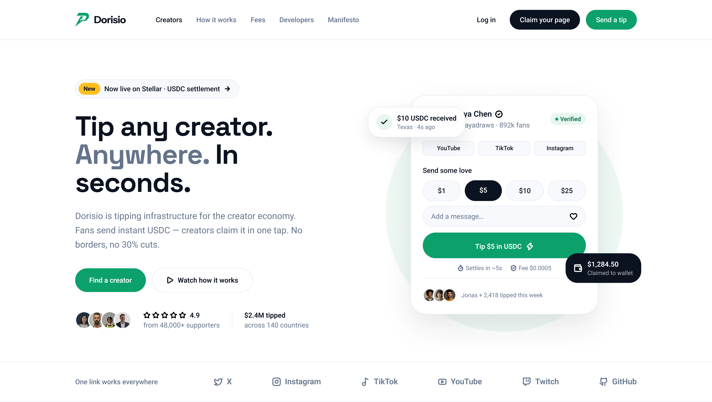

# Dorisio



Open-source creator payout infrastructure on Stellar for markets legacy platforms don't serve. Embeddable tipping SDK plus a reference app — direct wallet-to-wallet USDC settlement, on-chain earnings creators can prove, no platform cut.

## Repos

- **[backend](https://github.com/Dorisio/backend)** — API, auth, Stellar transaction orchestration · Fastify / Postgres / Redis
- **[sdk](https://github.com/Dorisio/sdk)** — Typed client + React hooks, embeddable in any platform · TypeScript
- **[frontend](https://github.com/Dorisio/frontend)** — Reference implementation (profiles, tip flow, dashboard) · Next.js / Tailwind

## Architecture

frontend → sdk → backend → Stellar

## Quick start

```bash
git clone https://github.com/Dorisio/backend-.git backend && cd backend && npm install
cd ../sdk && npm install
cd ../frontend && npm install
```

Requires Node 20+, Postgres 14+, Redis 6+.

## Status

- Auth, creator profiles, wallet linking
- Payments domain (tip transactions, Stellar settlement)
- SDK React hooks
- Frontend tip flow + dashboard
- Testnet deployment

## Principles

Contract-first (backend defines the API, SDK wraps it, frontend consumes it). SDK stays framework-agnostic so it's usable outside this org's own frontend.

---

Join us in making creator support frictionless, global, and accessible.
